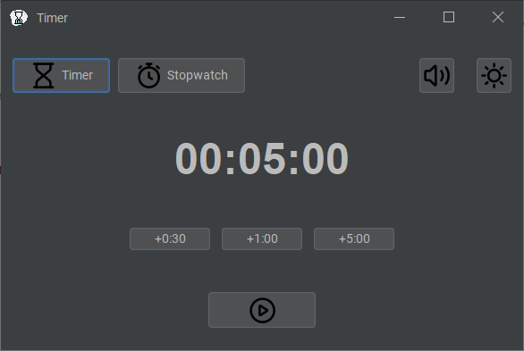
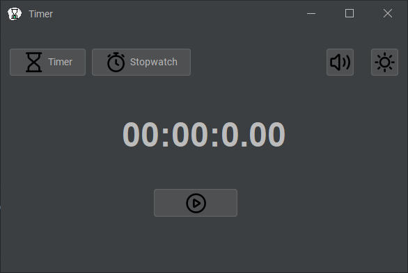

# CountdownTimer

🕒 **Project Overview**: CountdownTimer is a simple yet powerful countdown timer application designed for tracking time efficiently. Built using Java with a modern GUI, it provides an intuitive user experience and robust functionality.

If you find this repository useful, feel free to fork it and give it a star ⭐.

<div align="center">
  
  
  
  
  <a>
    
  </a>
</div>

## Table of Contents
- [🚀 Demo](#demo)
- [🖼️ Screenshots](#screenshots)
- [💻 Technologies](#technologies)
- [⚙️ Installation](#installation)
- [📜 License](#license)

## Screenshots


*The main countdown timer interface.*


## Features

✨ **Key Features**:
- Intuitive user interface for easy timer management
- Set custom countdown times in hours, minutes, and seconds
- Sound alert when the timer reaches zero
- Pause and resume functionality
- Dark/light theme toggle for better user experience

## Technologies

🛠️ **Built With**:
- **Java**
- **Swing** for GUI
- **FlatLaf**
- **MigLayout**


## Installation

1. **📥 Clone the repository**:
   ```bash
   git clone https://github.com/shadowxdgamer/CountdownTimer.git
   cd CountdownTimer

## 🐞 Bugs and Future Fixes

- There is currently a bug with the icon paths when executing runnable JARs and within the IDE. This affects the display of icons in the application.
- A backup file named `MainAppbackup.java` has been created, which contains the correct paths for the icons.
- Future fixes will address this issue to ensure that the icons load correctly in all execution environments.

## 📄 License

This project is licensed under the MIT License. 

